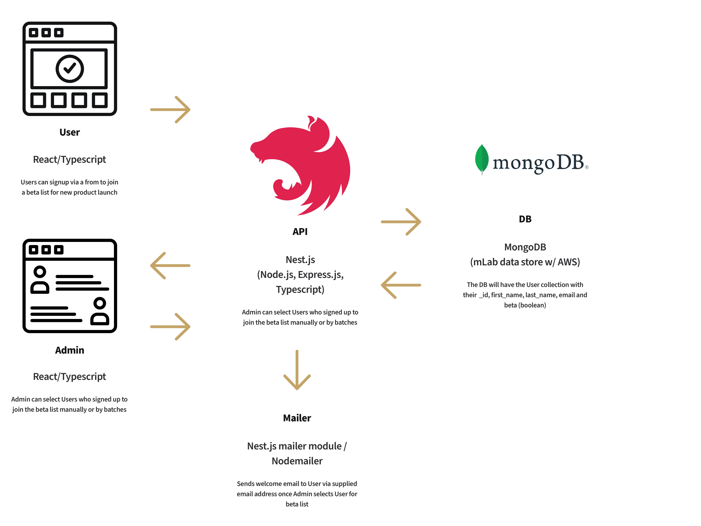

# Overview

This app will utilize a modern stack with [React.js](https://reactjs.org/)/[Typescript](https://www.typescriptlang.org/) (frontend), [Nest.js](https://nestjs.com/) (backend) and [MongoDB](https://www.mongodb.com/) (mLab data store w/ AWS). On the backend, Nest.js will handle the logic and RESTful API that the React frontend will consume. It's essentially like Node.js/Express.js backend with a few added benefits baked into Nest.js. This codebase will be on git and for simplicity, [Heroku](https://www.heroku.com/), a cloud service, will be implemented for deployment. This should ensure the architecture will be both optimized and scalable.

### Functionality

- Get user's name and email address from signup form
- Admin logs into UI and manually selects users from signup list by checkbox or selection (shift + click, cmd + click) or by batches with number range (select user number X to user number Y) or enters a number of users to an input that will grab a batch of random users in that amount entered
- Selected user moves out of signup list and into beta users list and are sent welcome email immediately after being selected into beta

### User groups

- Anyone wanting to sign up for the new product

## TOC

- [System architecture diagram](#system-architecture-diagram)
- [Backend](#backend)
- [Frontend](#frontend)

## System architecture diagram



## Backend

The backend will implement [Nest.js](https://nestjs.com/).

From the maintainers:
[Nest.js](https://nestjs.com/) is a framework for building efficient, scalable Node.js server-side applications. It uses modern JavaScript, is built with TypeScript (preserves compatibility with pure JavaScript) and combines elements of OOP (Object Oriented Programming), FP (Functional Programming), and FRP (Functional Reactive Programming).
Some additonal benefits of Nest.js [here](https://stackoverflow.com/questions/47733390/nestjs-vs-plain-express-performance/48226084#48226084) as explained by the author, [Kamil](https://twitter.com/kammysliwiec).

The data will be structured by a database scheme in TypeScript and a data transfer object (DTO)
The User schema will look something like:

```TypeScript
...
export const UserSchema = new mongoose.Schema({
  first_name: String;
  last_name: String;
  email: String;
  created_at: { type: Date, default: Date.now }
})
...
```

We would then create a module, controller and services for handling logic.
In the User service, we'd have some async functions like:

```TypeScript
...
// fetch all users
async getAllUsers(): Promise<User[]> {
  ...
}

// get a single user
async getUser(userID): Promise<User> {
  ...
}

// post a single user
async addUser(createUserDTO: CreateUserDTO): Promise<User> {
  ...
}

// edit user
async updateUser(userID, createUserDTO: CreateUserDTO): Promise<User> {
  // update user from signup list to beta list
}
...
```

The User controller would handle the JSON responses/queries for the fetching, posting and editing of User data.

User JSON object example:

```JSON
...
{
  "_id": 113,
  "first_name": "Jane",
  "last_name": "Doe",
  "email": "janedoe@gmail.com",
  "beta": false,
  "created_at": "2020-06-29T02:30:10Z"
}
...
```

User controller example:

```TypeScript
...
@Controller('user')
export class UserController {
  constructor(private userService: UserService) {
    // add user
    @Post('/create')
    async addUser(@Res() res, @Body() createUserDTO: CreateUserDTO) {
      const user = await this.userService.addUser(createUseerDTO)
      return res.status(HttpStatus.OK).json({
          message: "User has been created successfully",
          user
      })
    }

    // fetch user list
    @Get('users')
    async getAllUsers(@Res() res) {
      ...
    }

    // more...
  }
}
...
```

When an admin selects a user or users for the beta list, the backend will send a welcome email to the user from their supplied email. Implementing a [Nest.js module](https://github.com/nest-modules/mailer) in the backend, the app can use Nodemailer to send the welcome email. This module also comes packed with some templating for creating the markup for the email.

## Frontend

The frontend will implement [React.js](https://reactjs.org/) with [Typescript](https://www.typescriptlang.org/)

Using Typescript and deviating from JS in the React application will come with some benefits including type checking, enforcing and associating every variable within the application with a datatype.

The admin will have components for:

- the table that users will render in the admin ui (we can pass props to filter and sort users in this table, as well as manually selecting users for the beta list)
- the user component which is a presentational component and renders a user info
- the controls component, which will have the filters and batch handling controls for selecting new users for the beta list

```
- components
  - admin
    - controls.tsx
    - table.tsx
    - user.tsx
```

There will be different routes for viewing users in the admin, as well. These would include all users, new users only and users that were selected for the beta list.

For deployment, Heroku will be configured so that deploying the frontend React app is triggered when changes are pushed to the production branch in git.
